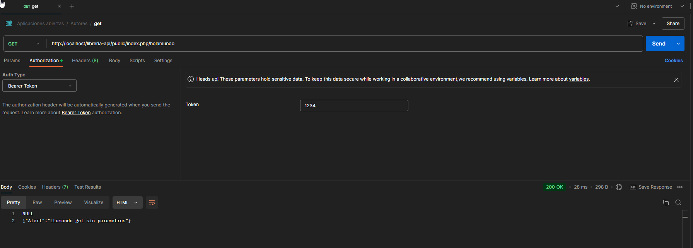

# Paso para crear API

## Crear estructura de carpetas

1. Crear una carpeta llamada **libreria-api** (puede usar cualquier otro nombre) en `C:\xampp\htdocs`.

### Crear estructura de carpetas iniciales

1. Dentro de **libreria-api** (o cualquier nombre), crear los siguientes folders:
    - `public`
    - `src`

2. Dentro de **public**, crear la siguiente estructura:
    - Carpeta `error`
        - Dentro de `error`, crear un archivo llamado `response.html`
    - Archivo `index.php`

3. Dentro de **src**, crear la siguiente estructura de folders:
    - Carpeta `controllers`
    - Carpeta `db`
    - Carpeta `models`
    - Archivo `routes.php`

### Estructura final de archivos

La estructura de archivos debería verse algo así:

```
C:.
+---public
|   |   index.php
|   |   
|   \---error
|           response.html
|
\---src
    |   routes.php
    |
    +---controllers
    \---db
```

---

## Contenido de los archivos

### 1. Archivo `public/error/response.html`

Agregar el siguiente código HTML dentro de `public/error/response.html`:

```html
<!DOCTYPE html>
<html lang="en">
<head>
    <meta charset="UTF-8">
    <title>Error</title>
    <style>
        body {
            font-family: Arial, sans-serif;
            background-color: #f2f2f2;
            color: #333;
            text-align: center;
            padding: 50px;
        }
        .container {
            display: inline-block;
            text-align: left;
            background: white;
            padding: 20px;
            border-radius: 5px;
            box-shadow: 0 0 10px rgba(0,0,0,0.1);
        }
        h1 {
            color: #e74c3c;
        }
    </style>
</head>
<body>
    <div class="container">
        <h1>ERROR</h1>
        <p>Este endpoint no existe.</p>
        <p>Revisa el URL e intente de nuevo.</p>
    </div>
</body>
</html>
```

### 2. Archivo `public/index.php`

Agregar dentro de `public/index.php` el siguiente contenido:

```php
<?php

require '../src/routes.php';

?>
```

### 3. Archivo `src/routes.php`

Agregar dentro de `src/routes.php` el siguiente contenido:

```php
<?php

// ENDPOINT PRINCIPAL: http://localhost/libreria-api/public/index.php/holamundo
// ENDPOINT CON UN PARÁMETRO: http://localhost/libreria-api/public/index.php/holamundo?nombre=Daniel

// Lógica de la API

$method = $_SERVER['REQUEST_METHOD'];

// Remueve "/" del inicio
$path = trim($_SERVER['PATH_INFO'], '/');

// Divide la ruta por "/" para obtener el endpoint y el posible parámetro
$segments = explode('/', $path);

// Captura la cadena de consulta completa después del "?" (por ejemplo: "id=123&nombre=juan")
$queryString = $_SERVER['QUERY_STRING'];

// Parseamos la cadena de consulta a un arreglo asociativo
parse_str($queryString, $queryParams);

// Extraemos los parámetros de la consulta
$nombre = isset($queryParams['nombre']) ? $queryParams['nombre'] : null;

if ($path == "holamundo") {
    switch ($method) {
        case 'GET':
            if ($nombre != "") {
                echo json_encode(['Alert' => 'Hola: ' . $nombre]);
            } else {
                echo json_encode(['Alert' => 'Llamando GET sin parámetros']);
            }
            break;
        default:
            Response::json(['error' => 'Método no permitido'], 405);
    }
} else {
    include "error/response.html";
}

?>
```

---


# Probar API.


ENDPOINT PRINCIPAL: http://localhost/libreria-api/public/index.php/holamundo
ENDPOINT CON UN PARÁMETRO: http://localhost/libreria-api/public/index.php/holamundo?nombre=Daniel

##  Ejemplo usando POSTMAN:




